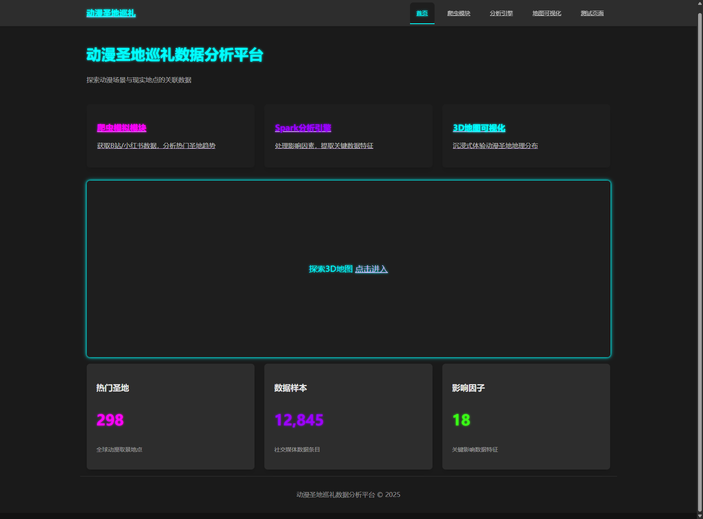

# 🗾 动漫圣地巡礼数据分析平台



> 🏮 探索动漫场景与现实地点的关联数据，感受二次元与三次元的奇妙联系！


## ✨ 项目特色

- 🤖 **智能爬虫模块** - 自动获取B站与小红书等平台的动漫圣地相关数据，实时可视化爬取过程
- 🔥 **Spark分析引擎** - 多维度分析圣地巡礼热度与影响因素，提供丰富的交互式图表
- 🌏 **3D地图可视化** - 沉浸式体验各地动漫场景的地理分布
- 🎨 **霓虹风格UI** - 具有赛博朋克风格的用户界面设计

## 🚀 快速开始

### 前提条件

* Node.js (v18+)
* npm 或 yarn
* Java 11+ (用于Spark)

### 启动步骤

#### 1. 克隆项目
```bash
git clone https://github.com/MilesSG/sakura-pilgrimage-insights.git
cd sakura-pilgrimage-insights
```

#### 2. 启动后端服务

```bash
# 进入后端目录
cd backend

# 安装依赖
npm install

# 启动开发服务器
npm run dev
```

后端服务将在 http://localhost:3000 启动，并提供以下API端点：
- `/api/pilgrimage/*` - 圣地巡礼数据接口
- `/api/crawler/*` - 爬虫管理接口
- `/api/analysis/*` - 数据分析接口

#### 3. 启动前端服务

```bash
# 在新的终端中进入前端目录
cd frontend

# 安装依赖
npm install

# 启动开发服务器
npm run dev
```

前端服务将在 http://localhost:5173 启动。

### 🌟 使用说明

1. 确保后端服务已经启动并正常运行
2. 启动前端服务
3. 在浏览器中访问 http://localhost:5173
4. 开始探索动漫圣地巡礼数据！

## 📂 项目结构

```
sakura-pilgrimage-insights/
├── frontend/                # React前端应用
│   ├── src/
│   │   ├── components/     # 共用组件
│   │   ├── pages/         # 页面组件
│   │   ├── hooks/         # 自定义钩子
│   │   ├── utils/         # 工具函数
│   │   └── types/         # TypeScript类型定义
│   └── ...
│
├── backend/                # NestJS后端应用
│   ├── src/
│   │   ├── controllers/   # 控制器
│   │   ├── services/      # 服务
│   │   ├── models/        # 数据模型
│   │   └── data/          # 数据处理
│   └── ...
│
└── README.md              # 项目文档
```

## 🔮 最新更新

* 📊 **分析引擎改进** - 新增多个交互式图表，包括热度排行、地域分布和情感分析
* 🎨 **UI优化** - 优化了图表展示效果，添加了霓虹风格的主题
* 🛠️ **性能优化** - 改进了图表渲染性能，优化了组件生命周期管理
* 🐛 **问题修复** - 修复了图表显示和数据加载相关的问题

## 🤝 贡献指南

欢迎为项目做出贡献！以下是贡献流程：

1. Fork 项目
2. 创建特性分支 (`git checkout -b feature/amazing-feature`)
3. 提交更改 (`git commit -m 'Add some amazing feature'`)
4. 推送到分支 (`git push origin feature/amazing-feature`)
5. 创建Pull Request

## 📝 许可证

本项目采用 MIT 许可证 - 详情见 LICENSE 文件

## 📞 联系方式

项目作者：MilesSG
项目仓库：[https://github.com/MilesSG/sakura-pilgrimage-insights](https://github.com/MilesSG/sakura-pilgrimage-insights)

---

⭐ 如果你喜欢这个项目，请给它一个星星！⭐ 

🙏 感谢所有贡献者和支持者！ 